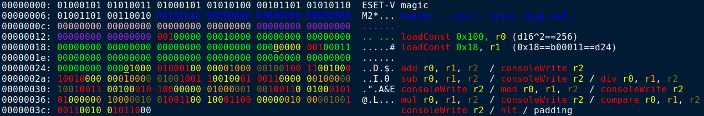
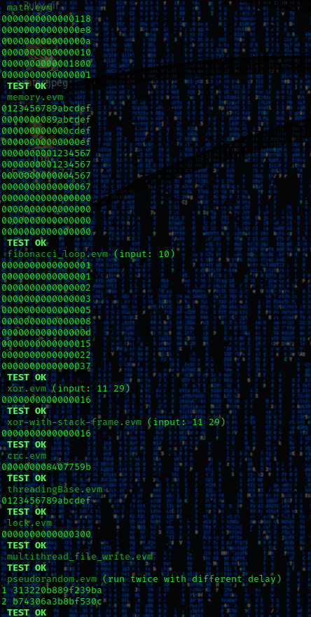

# EsetVm2

Virtual Machine for interpreting EsetVm2 (.evm) binary programs. 

## description

Input binaries (.evm) could be compiled from specific Eset assembeler (.easm) files with compiler ```task/compiler.py```. Eset assembler language is described in ```task/task.pdf```. Documentation contains description of file format, bytecode, data encoding, threading model, memory initialization etc. The code examples could be found in ```task/samples```. Precompiled examples are in ```task/samples/precompiled```.

## usage

### virtual machine compilation
```bash
make
```

### evm binaries interpretation
```bash
./esetvm2 task/samples/precompiled/math.evm
```

### regression tests
```bash
./test.sh
```

### easm scripts compilation
```bash
python2 task/samples/math.easm task/samples/precompiled/math.evm
```

## results

### source code
The source code could be found under ```src``` and ```includes``` directories. The ```task/task.pdf``` is fully implemented.

### analysis
Notes related to task and binary files analysis are stored as cherry tree notes ```analysis/notes/notes.ctb``` or as web page ```analysis/notes/ESET_HTML/index.html```. There could be found also chapter related to documentation bugs.



### own easm tests
I have created some own elementary easm/evm examples for specific testing purposes. They are stored under ```analysis/samples``` and ```analysis/samples/precompiled```. 

### memory leaks tests
The application was tested with *valgrind* and it's free of memory leaks.

### regression tests
The regression ```test.sh``` recompiles esetvm2 application and run it with all input binaries from ```samples\precompiled```. The results are compared with expected outputs stored in ```analysis\results``` and specified by ```samples\sample.txt```. The *philosophers.evm* runs without deadlock they were tested for more then 30 minutes.




